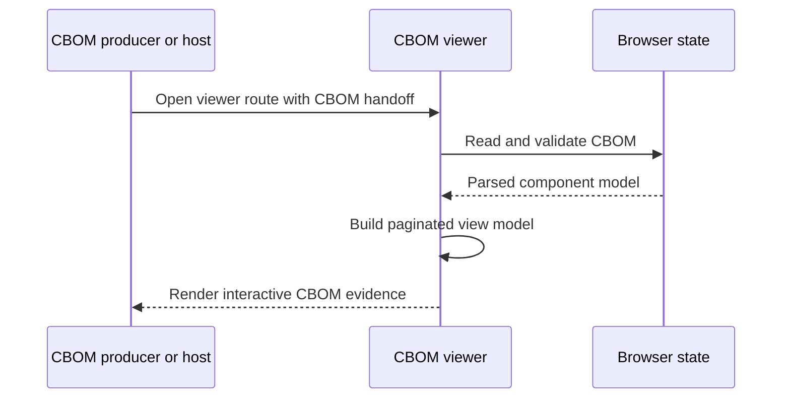

# BreachSAFE QuReddy CBOM Viewer

> **BreachSAFE release.** This project descends from CBOMkit, originally developed by IBM Research and released under the Apache-2.0 license. It is based on [PQCA/cbomkit](https://github.com/PQCA/cbomkit) and is released and maintained by BreachSAFE as the **QuReddy CBOM Viewer**. BreachSAFE changes include CBOM upload and host handoff (`postMessage` + `?cbom` URL), report-mode rendering, and BreachSAFE branding. The upstream license in `LICENSE.txt` is unmodified.

## Contents

1. [Release channel](#release-channel)
2. [Quickstart](#quickstart)
3. [QuReddy integration](#qureddy-integration)
4. [CBOM data flow](#cbom-data-flow)
5. [CBOM input](#cbom-input)
6. [Development](#development)
7. [Upstream CBOMkit reference](#upstream-cbomkit-reference)
   1. [Frontend and CBOMkit-coeus](#frontend-and-cbomkit-coeus)
      1. [CBOMkit-coeus](#cbomkit-coeus)
   2. [API Server](#api-server)
      1. [Features](#features)
   3. [Compliance](#compliance)
      1. [External Compliance Evaluation](#external-compliance-evaluation)
         1. [Policy Definition in OPA](#policy-definition-in-opa)
         2. [Findings Format](#findings-format)
         3. [Evaluation Results](#evaluation-results)
      2. [Configuration](#configuration)
   4. [Handling of Credentials](#handling-of-credentials)
   5. [Scanning and CBOM Generation](#scanning-and-cbom-generation)
      1. [Supported languages and libraries](#supported-languages-and-libraries)
8. [Contribution Guidelines](#contribution-guidelines)
9. [License](#license)

## Release channel

`ghcr.io/breachsafe/qureddy-cbom-viewer:latest` is the BreachSAFE release image for the
standalone viewer. A published GitHub release creates the corresponding semantic-version
image tags; use an immutable digest for reproducible deployments.


[](LICENSE.txt) <!--- long-description-skip-begin -->

## QuReddy integration

The viewer is a standalone BreachSAFE web surface for CycloneDX CBOM artifacts. A CBOM
producer or host application supplies the artifact; this repository owns CBOM parsing,
pagination, compliance presentation, and visual rendering.

```mermaid
flowchart LR
    A[CBOM producer or<br/>host application] -->|file, route, or button| B[CBOM artifact]
    B -->|postMessage or ?cbom handoff| C[BreachSAFE<br/>QuReddy CBOM Viewer]
    C --> D[Parse and validate]
    D --> E[Paginated tables and compliance views]

    classDef host fill:#dbeafe,stroke:#2563eb,color:#111827
    classDef artifact fill:#fef3c7,stroke:#d97706,color:#111827
    classDef viewer fill:#dcfce7,stroke:#16a34a,color:#111827
    classDef output fill:#f3e8ff,stroke:#9333ea,color:#111827
    class A host
    class B artifact
    class C,D viewer
    class E output
```



## CBOM data flow



For upstream CBOMkit context, the original project is a toolset for dealing with
Cryptography Bill of Materials (CBOM). It includes a
- **CBOM Generation** ([CBOMkit-hyperion](https://github.com/cbomkit/sonar-cryptography), [CBOMkit-theia](https://github.com/cbomkit/cbomkit-theia)): Generate CBOMs from source code by scanning private and public git repositories to find the used cryptography.
- **CBOM Viewer ([CBOMkit-coeus](https://github.com/cbomkit/cbomkit?tab=readme-ov-file#cbomkit-coeus))**: Visualize a generated or uploaded CBOM and access comprehensive statistics.
- **CBOM Compliance Check**: Evaluate CBOMs created or uploaded against specified compliance policies and receive detailed compliance status reports.
- **CBOM Database**: Collect and store CBOMs into the database and expose this data through a RESTful API.


> [!WARNING]
> The CBOMkit service does not build any repository prior to scanning. For Java repositories in particular, this means that we cannot rely on any build results (class files, jars) that could improve the scanning result. This potentially reduces completeness and accuracy of the findings since some Java symbols may not be resolved. For better results, use the [sonar-cryptography-plugin](https://github.com/cbomkit/sonar-cryptography) together with SonarQube or [CBOMkit-action](https://github.com/cbomkit/cbomkit-action) embedded in a pipeline definition that builds the code before scanning.

## Quickstart

Run the published viewer image:

```console
docker run --rm -p 8000:8000 \
  ghcr.io/breachsafe/qureddy-cbom-viewer:latest
```

Open <http://localhost:8000>. Supply a CycloneDX CBOM by file upload or through
the documented host handoff. Pin the image by digest for reproducible deployments.

Build the viewer locally from this repository:

```console
git clone https://github.com/BreachSAFE/breachsafe-cbom-kit-viewer.git
cd breachsafe-cbom-kit-viewer/frontend
npm ci
npm run build -- --mode development
npm run serve -- --host 127.0.0.1
```

The local development server listens on port `8001` by default.

## CBOM input

The viewer accepts valid CycloneDX CBOM artifacts from any compatible producer.
Inputs may describe cryptographic assets discovered in source code, packages,
endpoints, runtime environments, infrastructure, or manually curated inventories.
The viewer presents the artifact; the producing system remains responsible for
collection, provenance, storage, and policy decisions.

Supported entry points are:

- file upload in the standalone viewer
- host handoff using `postMessage`
- `?cbom` URL handoff

The viewer does not require the producer to use a particular language or framework.

## Development

```console
cd frontend
npm ci
npm run lint
npm run build -- --mode development
npm run serve -- --host 127.0.0.1
```

The frontend uses Vue 2, Carbon Design components, and the existing CBOMkit
viewer implementation. Browser regression coverage is in `frontend/tests/`.

<details>
<summary>Upstream CBOMkit implementation reference</summary>

## Upstream CBOMkit reference

The upstream CBOMkit consists of three integral components: a web frontend, an API server, and a database.
In the `ext-compliance` deployment, an additional Open Policy Agent service is used for compliance evaluation (see [External Compliance Evaluation](#external-compliance-evaluation)).

### Frontend and CBOMkit-coeus

The web frontend serves as an intuitive user interface for interacting with the API server. It offers a range of functionalities, including:
 - Browsing the inventory of existing Cryptographic Bills of Materials (CBOMs)
 - Initiating new scans to generate CBOMs 
 - Uploading existing CBOMs for visualization and analysis

#### CBOMkit-coeus

For enhanced flexibility, the frontend component can be deployed as a standalone version, known as the CBOMkit-coeus. 
This option allows for streamlined visualization and compliance analysis independent of the full CBOMkit suite.

```shell
# use this command if you want to run only the CBOMkit-coeus
make coeus
```

### API Server

The API server functions as the central component of the CBOMkit, offering a comprehensive RESTful API 
(see [OpenAPI specification](openapi.yaml)) with the following key features:

#### Features
- Retrieve the most recent generated CBOMs
- Access stored CBOMs from the database
- Perform compliance checks for user-provided CBOMs against specified policies 
- Conduct compliance assessments for stored or generated CBOMs against defined policies

*Sample Query to Retrieve CBOM project identifier*
```shell
curl --request GET \
  --url 'http://localhost:8081/api/v1/cbom/pkg:github%2Fkeycloak%2Fkeycloak@<commit_hash>'
```

In addition to the RESTful API, the server incorporates WebSocket integration, enabling:
 - Initiation of CBOM generation through Git repository scanning 
 - Real-time progress updates during the scanning process, transmitted via WebSocket connection

### Compliance

A critical component of the CBOMkit is its compliance checking mechanism for Cryptography Bills of Materials (CBOMs). 
The CBOM structure represents a hierarchical tree of cryptographic assets detected and used by an application. 
This standardized format facilitates the development and implementation of generalized policies 
to identify and flag violations in cryptographic usage.

The CBOMkit currently features a foundational `quantum-safe` compliance check. 
This initial implementation serves as a proof of concept and demonstrates the system's capability to evaluate
cryptographic components against defined policies.

The compliance framework is designed with extensibility in mind, providing a solid platform for:
 - Implementing additional compliance checks 
 - Enhancing existing verification processes 
 - Integrating custom compliance checks (external)

#### External Compliance Evaluation

CBOMkit supports the use of [Open Policy Agent (OPA)](https://www.openpolicyagent.org) as an external compliance evaluation service. OPA evaluates compliance based on user-defined policies written in its declarative policy language, [Rego](https://www.openpolicyagent.org/docs/policy-language).

In CBOMkit, you can configure OPA as an external compliance service using either:
- the environment variable `CBOMKIT_OPA_API_BASE`, or
- the configuration key `cbomkit.ext-policies.opa-api-base` in [application.properties](src/main/resources/application.properties).

If either option is specified, it must contain the base URL of a running OPA instance. If the variable or property is unset, or if CBOMkit cannot connect to OPA, the system automatically falls back to its built-in internal compliance service.

> [!NOTE]
> The compliance service is selected once, on first use, and then cached for the lifetime of the process. Changing `CBOMKIT_OPA_API_BASE` (or starting OPA after CBOMkit) therefore requires a restart of the API server to take effect.

The internal compliance service implements a fixed “quantum-safe policy.” This built-in policy checks the quantum safety of asymmetric algorithms using whitelists of algorithm OIDs and names.

##### Policy Definition in OPA

CBOMkit provides a sample Rego policy, [quantum_safe.rego](opa/quantum_safe.rego), which replicates the behavior of the internal compliance service.
A Rego policy file begins with a package declaration and defines one or more rules. All CBOMkit policies must start with:

```rego
package policies
```

Each rule includes:
- A header,
- A conditional expression (the logic), and
- A JSON object to be returned when the condition is satisfied.

For compliance evaluation, OPA executes these rules on the set of CBOM components.
By convention, a rule header should follow this format:

```rego
<policy_name>.findings contains finding if ...
```

The `<policy_name>` identifies the policy being evaluated. It must match the policy name configured in the CBOMkit front end through the environment variable `VUE_APP_POLICY_NAME`.
By default, this is `quantum_safe`, the predefined policy included in [quantum_safe.rego](opa/quantum_safe.rego).

When running CBOMkit as a Docker application via `make ext-compliance` (see below), the OPA container is automatically configured with this default policy file.
If you run OPA yourself instead, you can push the sample policy to a running instance with [upload_quantum_safe.sh](opa/upload_quantum_safe.sh):

```shell
cd opa
# defaults to http://localhost:8181, pass a different base URL as first argument
./upload_quantum_safe.sh
```

###### Findings Format
Each policy must produce a JSON list named `findings`, which CBOMkit expects in OPA’s evaluation response.
Every finding object must contain at least these three attributes:

```rego
{
  "bom-ref": "string",         # The UUID of the matching component (usually component["bom-ref"])
  "result": "string",          # One of ["quantum-safe", "quantum-vulnerable", "na", "unknown"]
  "rule": "string",            # The name of the rule
  "property": "string",        # Optional: the relevant CBOM property name
  "value": "string" or numeric # Optional: the property’s value
}
```

If any mandatory attribute of a finding is missing, the evaluation will fail, and CBOMkit will revert to its internal compliance service. The result value conveys the rule’s outcome. `NA` indicates that the rule does not apply to a certain component (for example, symmetric algorithms in the predefined "quantum_safe" policy). "property" and "value" are optional and used when rendering compliance details in the CBOMkit interface.

###### Evaluation Results
A compliance policy acts as a knowledge base defining what is compliant or non-compliant. If a component does not match any rule, no finding is produced; CBOMkit then marks the component as "unknown".

The overall compliance status is considered not quantum-safe if any component is marked "quantum-vulnerable." Conversely, if no "quantum-vulnerable" components are found, or if no rule matches and hence no findings are generated, the CBOM is assumed to be quantum-safe.

> [!NOTE]
> This same “quantum-safe” result will also occur for a non-empty CBOM if OPA cannot locate the specified policy or if no policy is configured at all.

#### Configuration

Different deployment configurations utilize distinct sources for compliance verification.

| Deployment       | How is the compliance check performed?                                                                                                                                                                                                                                                                                                                                                                                               |
|------------------|--------------------------------------------------------------------------------------------------------------------------------------------------------------------------------------------------------------------------------------------------------------------------------------------------------------------------------------------------------------------------------------------------------------------------------------|
| `coeus`          | A `quantum-safe` algorithm compliance check is natively implemented within the frontend. This integration allows for immediate, client-side assessment of basic quantum resistance criteria.                                                                                                                                                                                                                                         |
| `production`     | In the standard deployment, a core compliance service is integrated into the backend service. This implementation enables the execution of compliance checks via the RESTful API, providing a scalable and centralized approach to cryptographic policy verification.                                                                                                                                                                |
| `ext-compliance` | In advanced deployment scenarios, compliance evaluation is delegated to a dedicated external service. This service can invoked by the API server as needed. This configuration maintains the standard user experience for both the frontend and API of the CBOMkit, mirroring the functionality of the `production` configuration while allowing for more sophisticated or specialized compliance checks to be performed externally. |

### Handling of Credentials

When a new scan of a GitHub repository is started, CBOMkit generates a temporary local clone
of the repository. The frontend enables users to provide GitHub credentials 
(either a username and password or a personal access token). These credentials are not
logged or stored; instead, they are directly forwarded 
to [JGit](https://github.com/eclipse-jgit/jgit) to facilitate the cloning process. 
After the scan completes - regardless of whether it succeeds or fails - the temporary 
local clone is deleted.

### Scanning and CBOM Generation

The CBOMkit leverages advanced scanning technology to identify cryptographic usage within source code and generate 
Cryptography Bills of Materials (CBOMs). This scanning capability is provided by the 
[CBOMkit-hyperion (Sonar Cryptography Plugin)](https://github.com/cbomkit/sonar-cryptography), an open-source tool developed by IBM.

#### Supported languages and libraries

The current scanning capabilities of the CBOMkit are defined by the Sonar Cryptography Plugin's supported languages 
and cryptographic libraries:

| Language | Cryptographic Library                                                                         | Coverage | 
|----------|-----------------------------------------------------------------------------------------------|----------|
| Java     | [JCA](https://docs.oracle.com/javase/8/docs/technotes/guides/security/crypto/CryptoSpec.html) | 100%     |
|          | [BouncyCastle](https://github.com/bcgit/bc-java) (*light-weight API*)                         | 100%[^1] |
| Python   | [pyca/cryptography](https://cryptography.io/en/latest/)                                       | 100%     |
| Go       | [crypto](https://pkg.go.dev/crypto) (*standard library*)                                      | 100%[^2] |
|          | [golang.org/x/crypto](https://pkg.go.dev/golang.org/x/crypto)                                 | Partial[^3] |


[^1]: We only cover the BouncyCastle *light-weight API* according to [this specification](https://javadoc.io/static/org.bouncycastle/bctls-jdk14/1.80/specifications.html)
[^2]: All packages under [`crypto`](https://pkg.go.dev/crypto@go1.25.6#section-directories) are covered except `crypto/x509`
[^3]: Covers `golang.org/x/crypto/hkdf`, `golang.org/x/crypto/pbkdf2`, and `golang.org/x/crypto/sha3`

While the CBOMkit's scanning capabilities are currently bound to the Sonar Cryptography Plugin, the modular 
design of this plugin allows for potential expansion to support additional languages and cryptographic libraries in 
future updates.

</details>

## Contribution Guidelines

If you'd like to contribute to CBOMkit, please take a look at our
[contribution guidelines](CONTRIBUTING.md). By participating, you are expected to uphold our [code of conduct](CODE_OF_CONDUCT.md).

We use [GitHub issues](https://github.com/BreachSAFE/breachsafe-cbom-kit-viewer/issues) for tracking requests and bugs. For questions,
start a discussion using [GitHub Discussions](https://github.com/BreachSAFE/breachsafe-cbom-kit-viewer/discussions).

## License

[Apache License 2.0](LICENSE.txt)
